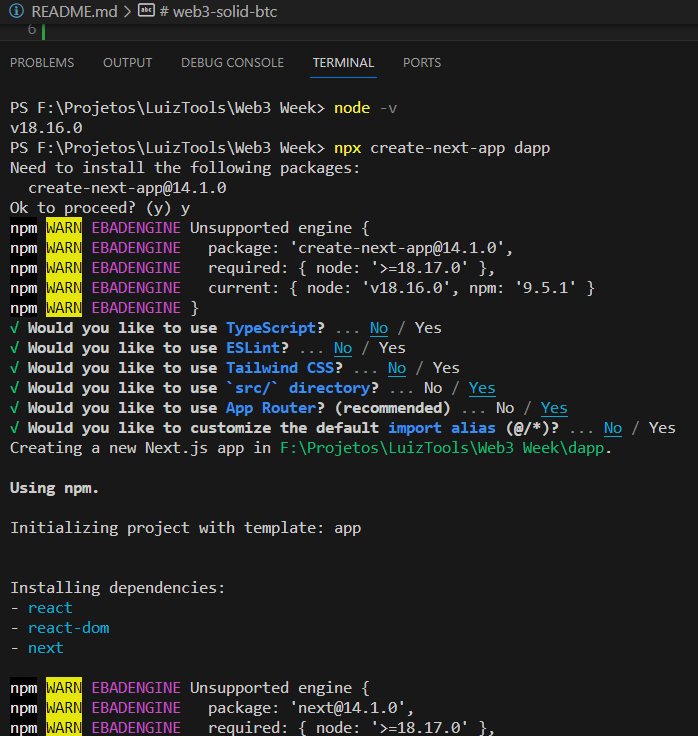

# web3-solid-btc

## Instalar Node JS e Next JS

* Instalar o node  
   * Verificar a versão do node

            node -v

###### Criar o projeto 
    npx create-next-app dapp

    √   Would you like to use TypeScript? ... No 
    √   Would you like to use ESLint? ... No 
    √   Would you like to use Tailwind CSS? ... No 
    √   Would you like to use `src/` directory? ...  Yes
    √   Would you like to use App Router? (recommended) ... Yes
    √   Would you like to customize the default import alias (@/*)? ... No 
        Creating a new Next.js app in F:\Projetos\LuizTools\Web3 Week\dapp.

###### Rodar o comando 
    npm run dev

###### Verificar a aplicação: 
    http://localhost:3000/

Fontes:

https://getbootstrap.com/docs/5.3/getting-started/download/

### Aulas:
    Aula 01: 
    
- [Link dos fontes da aula 01](https://github.com/luiztools-cursos/web3-week-3)

- [Link da live 01](https://www.youtube.com/watch?v=vhXO9Pw2LGE)

--------------

    Aula 02

- [Link dos fontes da aula 02 (incluindo imagens e CSS)](https://github.com/luiztools-cursos/web3-week-3)

- [Faucet da Binance](https://www.bnbchain.org/en/testnet-faucet)

- [Faucet alternativo](https://faucet.quicknode.com/binance-smart-chain/bnb-testnet)

- [Link da live de terça](https://www.youtube.com/watch?v=gZM6NksErkU)

- [Link da live de quarta](https://youtube.com/live/r1G-SGdWnoc?feature=share)

- [Site da MetaMask](https://metamask.io/)

- [Explorador de blocos da Testnet](https://testnet.bscscan.com/)

- Vídeo de instalação do VS Code e Node.js: [Como instalar e configurar Node.js no Windows](https://www.youtube.com/watch?v=iJ-BUhcZOSY) — disq.us

- [Site do Bootstrap](https://getbootstrap.com/)

        Aula 3:

rodar o comando npm install web3 na pasta dapp

- [Link do roadmap](https://www.luiztools.com.br/post/materiais/roadmap-de-estudos-web3-blockchain/)
    - [PDF](https://drive.google.com/file/d/1ZGUcCEOGkEH1pCODKP638cEcbn2edPzY/view)

- [Link dos fontes da aula 03](https://github.com/luiztools-cursos/web3-week-3)

- [Link da live de quinta](https://www.youtube.com/watch?v=pW5_ZPXatDs)

- [Link da live de sexta](https://www.youtube.com/live/D-fUXuSn5Pk)